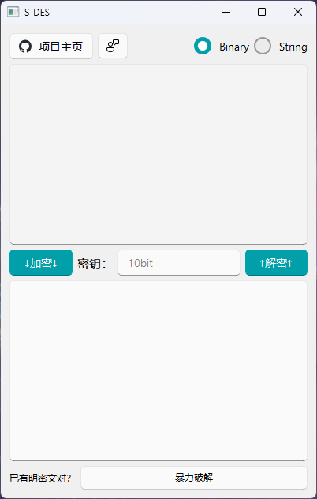
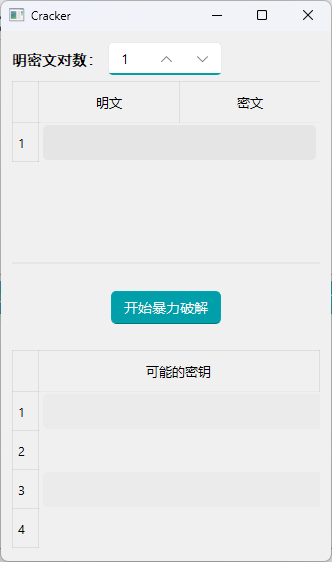

# S-DES_Python

❤️ S-DES_Python is a small project about simple DES encryption algorithm. It provides you with a GUI interface, which supports encryption and decryption of 8 bits of plaintext and strings with 10 bits secret key. And it also provides a mode of brute force the secret key with some pairs( or only one pair) of plaintext and ciphertext.❤️

****

### GUI😺:





### Quickly start!🤖

```
git clone git@github.com:MaxAndFelix/S-DES_Python.git
cd S-DES_Python
pip install -r requirements.txt
python main.py
```

