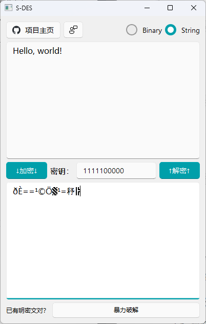
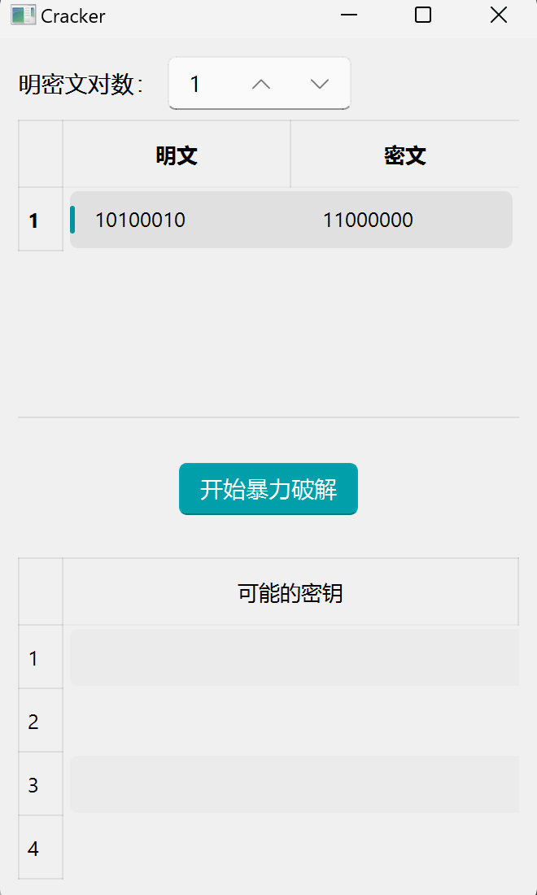

# 测试结果

## 1 作业概述

​	本次作业根据"信息安全导论"课程第5次课讲述的S-DES算法，以及所学知识的基础上，使用Python+QT来编程实现加密解密、暴力破解算法，以及后续的闯关测试。

## 2 闯关测试

### 2.1 第1关：基本测试

​	根据S-DES算法编写和调试程序，提供GUI解密支持用户交互。输入可以是8bit的数据和10bit的密钥，输出是8bit的密文。

GUI用户交互界面：

使用一对明密文对进行加/解密操作，密钥为1111100000：

测试结果：加密结果和解密结构均如上图所示完成，测试通过。

### 2.2 第2关：交叉测试

​	考虑到是**算法标准**，班级内所有人在编写程序的时候需要使用相同算法流程和转换单元(P-Box、S-Box等)，以保证算法和程序在异构的系统或平台上都可以正常运行。设有A和B两组位同学(选择相同的密钥K)；则A、B组同学编写的程序对明文P进行加密得到相同的密文C；或者B组同学接收到A组程序加密的密文C，使用B组程序进行解密可得到与A相同的P。

​	我们与[调包小子和调参小子队](https://github.com/DeusExMachina2/S-DES)进行交叉测试，双方采用相同的密钥1111100000对明文11001111进行加密：

我们的结果：

对方的结果：

测试结果：得到了相同结果，测试通过。

### 2.3 第3关：拓展功能

​	考虑到向实用性扩展，加密算法的数据输入可以是ASII编码字符串(分组为1 Byte)，对应地输出也可以是ACII字符串(很可能是乱码)。程序设计了使用字符串的形式进行输入和输出的模式，只需要切换到String模式即可将字符串加密或将密文（字符串形式）解密为明文字符串：

测试结果：如图，测试通过。

### 2.4 第四关：暴力破解

​	假设我们拥有使用相同密钥通过S-DES进行加密的明密文对，由于数据量不大，可以尝试使用最暴力的方式（枚举）进行破解，使用了多线程的方式提升破解的效率，并计算了耗费的时间。支持在已知一对或多对明密文进行暴力破解。

测试结果：暴力破解成功，测试通过。

### 2.5 第五关：封闭测试

​	我们使用第四关暴力测试所得到的不同密钥，对明文进行加密，观察是否加密能够得到相同的密文：

​	测试发现：四个不同的密钥对上述明文段都能加密成相同的密文，说明对应明文空间任意给定的明文分组，会出现选择不同的密钥，加密得到相同密文的情况。完成封闭测试

